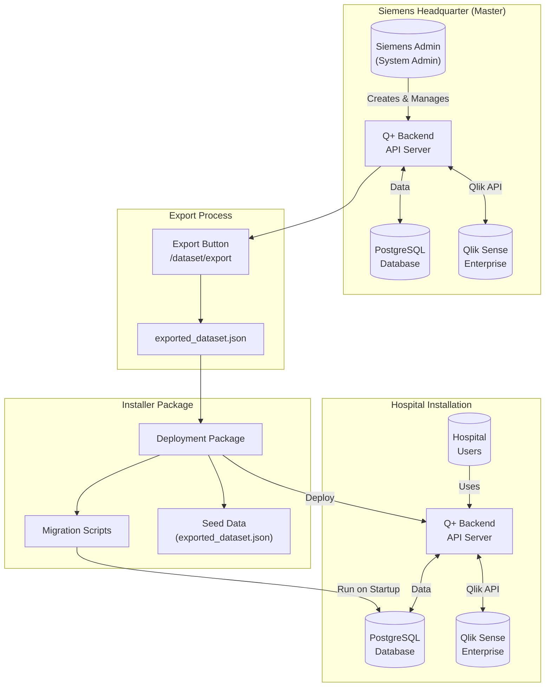
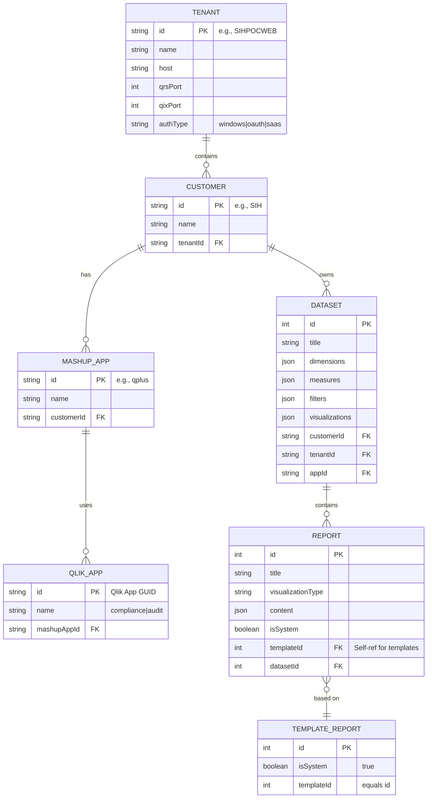
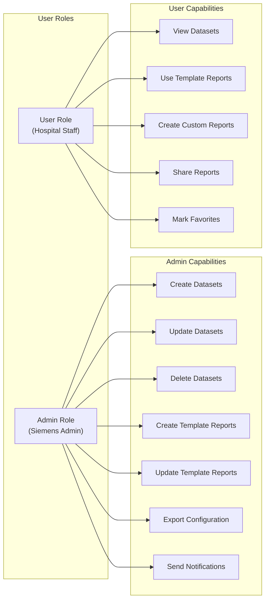
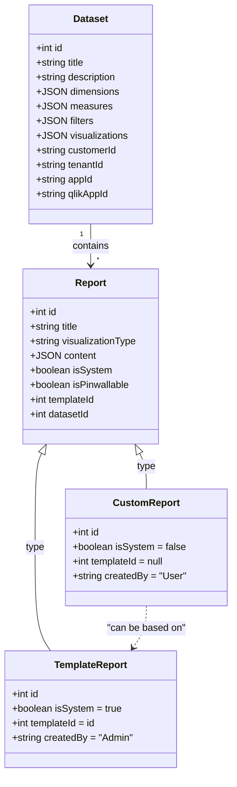
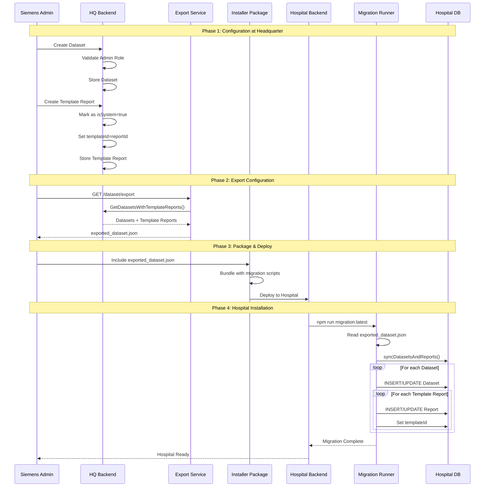
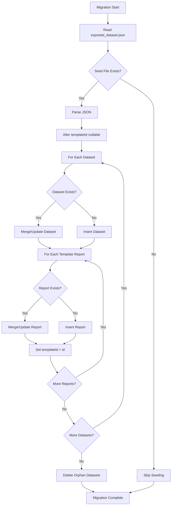
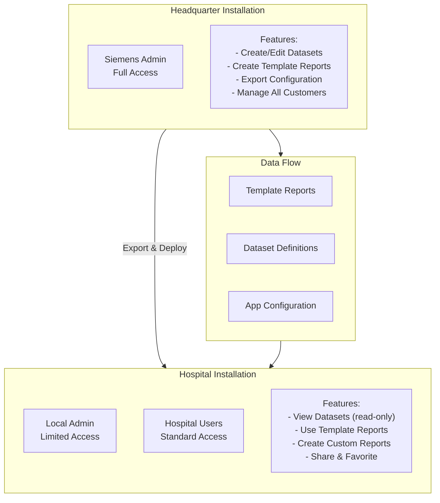

# Architecture: Deployment & Migration System

This document explains the architecture of the SIH Atellica system, focusing on the deployment model, migration process, and how datasets and template reports flow from headquarter to hospital installations.

---

## System Overview



---

## Multi-Tenant Hierarchy

The system supports multiple tenants (Qlik servers), customers (hospitals/headquarters), and applications within a single deployment.



---

## Siemens Admin Role (System Master)

The Siemens Admin at headquarter is the master of the system with full control over datasets and template reports.



### Role Verification Code

```typescript
// From src/lib/util.ts
function checkIfUserIsAdmin(userData: QlikAuthData, scopes?: string[]) {
    const isAdmin = userData.activeRole === 'admin';

    if (scopes && scopes.length) {
        return scopes.some((s) => userData.scopes.includes(s)) && isAdmin;
    }
    return isAdmin;
}
```

---

## Dataset & Template Report Structure



---

## Migration & Deployment Flow



---

## Export/Import Data Structure

### exported_dataset.json Format

```json
{
  "apps": {
    "compliance": "ece91d50-9e52-460c-8d50-8d6abf6442d3",
    "audit": "dc31bbe0-c11e-4d73-9188-5fba3813c4a5"
  },
  "datasets": [
    {
      "id": 3,
      "title": "Compliance Dataset",
      "qlikAppId": "ece91d50-...",
      "dimensions": "[{\"qId\":\"dim1\"}, ...]",
      "measures": "[{\"qId\":\"meas1\"}, ...]",
      "filters": "[{\"qId\":\"filter1\"}, ...]",
      "visualizations": "[{\"name\":\"table\"}, ...]",
      "customerId": "SIH",
      "tenantId": "SIHPOCWEB",
      "appId": "qplus",
      "reports": [
        {
          "id": 33,
          "title": "Monthly Compliance Report",
          "visualizationType": "table",
          "content": "{...}",
          "isSystem": true,
          "templateId": 33,
          "datasetId": 3
        }
      ]
    }
  ]
}
```

---

## Migration Script Logic



---

## Hospital vs Headquarter Installation



---

## Key Files Reference

| File | Purpose |
|------|---------|
| `src/database/seeds/exported_dataset.json` | Seed data for hospital deployments |
| `src/database/migrations/20240415115523_add-init-seed-datasets-and-reports.ts` | Migration that imports seed data |
| `src/actions/dataset/ExportDatasetAction.ts` | Exports datasets + template reports |
| `src/actions/dataset/CreateDatasetAction.ts` | Admin-only dataset creation |
| `src/actions/report/CreateReportAction.ts` | Report creation (template vs custom) |
| `src/repositories/DatasetRepository.ts` | GetDatasetsWithTemplateReports() |
| `src/lib/util.ts` | checkIfUserIsAdmin() role verification |
| `configuration.json` | Tenant/Customer/App hierarchy |

---

## Summary

1. **Siemens Admin** at headquarter creates and manages datasets and template reports
2. **Export** generates `exported_dataset.json` with all configurations
3. **Installer** bundles the export with migration scripts
4. **Hospital deployment** runs migrations that import the seed data
5. **Hospital users** can use template reports and create their own custom reports
6. **Multi-tenancy** allows the same system to serve multiple hospitals with isolated data

The system ensures that hospital installations always receive the latest dataset definitions and template reports from the headquarter while maintaining data isolation between different customers.
